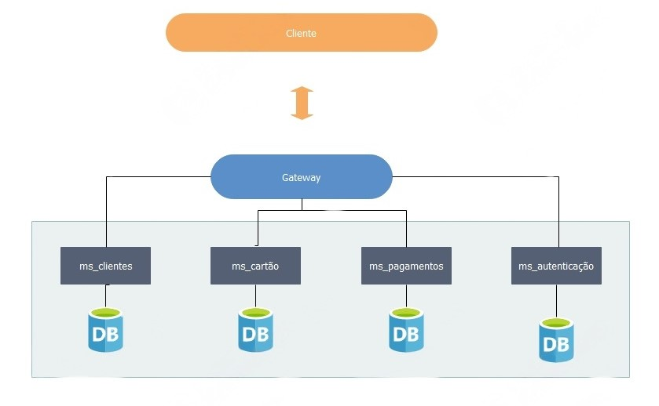

# Processadora de Cartão

É um sistema de para processamento de pagamentos de operadoras de cartão de crédito. O principal objetivo é receber os dados das transações com cartão de crédito e validar se o cartão do cliente possui limite disponível para realização da compra. Este sistema garantirá a verificação precisa e em tempo real do limite de crédito dos clientes, proporcionando uma experiência de pagamento segura e confiável.

O **módulo Autenticação** é responsável pelo gerenciamento de informações e pela criação de acesso. Por meio deste acesso, realizamos a autenticação e autorização dos demais microserviços via JWT.

O **módulo Clientes** controla o cadastro de clientes, armazenando dados como endereço e contatos.

O **módulo Cartão** trata da funcionalidade de gerar um cartão a partir das informações fornecidas, como o número do cartão é limite.

Por fim, o **módulo de Pagamento** realiza uma simulação de pagamento por  cartão de crédito. Também podemos consultar o status do pagamento, verificando se foi bem-sucedido ou não.

## Link do GitHub do projeto

https://github.com/FlaviaMonteiro31/ProcessadoraDeCartao.git

## Tecnologias utilizadas

-   Java 17
-   Spring boot 3.1.0
-   DevTools 
-   Lombok
-   Spring Web 
-   Open API
-   Spring Data JPA
-   Bean Validation 
-   Spring Cloud (Para integração dos micro serviços)
-   GIT (Controle de versão do projeto)
-   IDE's Intellij
-   Insomnia
-   PostgreSQL
-   Docker

## Como executar o projeto

1º - Ter instalado Docker na máquina 
2º - Executar o comando docker:

	docker-compose build
	docker-compose  up

## Fluxo de trabalho

Este sessão visa explanar o fluxo principal de usabilidade dos microserviços.
Os microserviços foram definidos com 512 de memória no docker. 

 1. Solicitar token de acesso usando usuário e senha:  
			  *POST: http://localhost:8080/api/autenticacao
			  {
			    "usuario": "adj2",
			    "senha": "adj@1234"
		      }*
      
 2. Realizar o cadastro de cliente:
     *POST: http://localhost:8080/api/cliente
	     {
		   "cpf":"016.557.900-56",
		   "nome":"João da Silva",
		   "email":"joao@example.com",
		   "telefone":"+55 11 91234-5678",
		   "rua":"Rua A",
		   "cidade":"Cidade",
		   "estado":"Estado",
		   "cep":"12345-678",
		   "pais":"Brasil"
		}*
	
 3. Gerar cartão de crédito para o cliente informando os dados e o limite para o cartão de crédito *****(Está API possui uma tolerância para expiração do token de 2 minutos após a geração do token )*****:
	     *POST: http://localhost:8080/api/cartao
	     { 
		"cpf":"016.557.900-56", 
		"limite":1000, 
		"numero":"1234123412341237", 
		"data_validade":"12/24",
		"cvv":"123"
		}*
	
 4. Solicitar a autorização de um pagamento de um cartão:
	 *POST: http://localhost:8080/api/pagamentos
		 {
		   "cpf":"016.557.900-56",
		   "numero":"1234123412341237", 
		   "data_validade":"12/24",
		   "cvv":"123",
		   "valor":500.00
		}*
	
 5. Consultar o status do pagamento:
	  *GET: http://localhost:8080/api/pagamentos/cliente/016.557.900-56*

## Swaggers

 - **Ms_autenticacao**: [Swagger_ms_autenticacao.json](Swagger_Ms_autenticacao.json)
   
 - **Ms_pagamentos**: [Swagger_ms_pagamentos.json](Swagger_Ms_pagamentos.json)
   
 - **Ms_cartao**: [Swagger_Ms_cartao.json](Swagger_Ms_cartao.json)
   
 - **Ms_clientes**:[Swagger_Ms_clientes.json](Swagger_Ms_clientes.json)

## Requisições Insomnia

Para testes dos microserviços foi utilizado as seguintes requisições.

[Requisições Insomnia](Insomnia_FluxosCartao)

